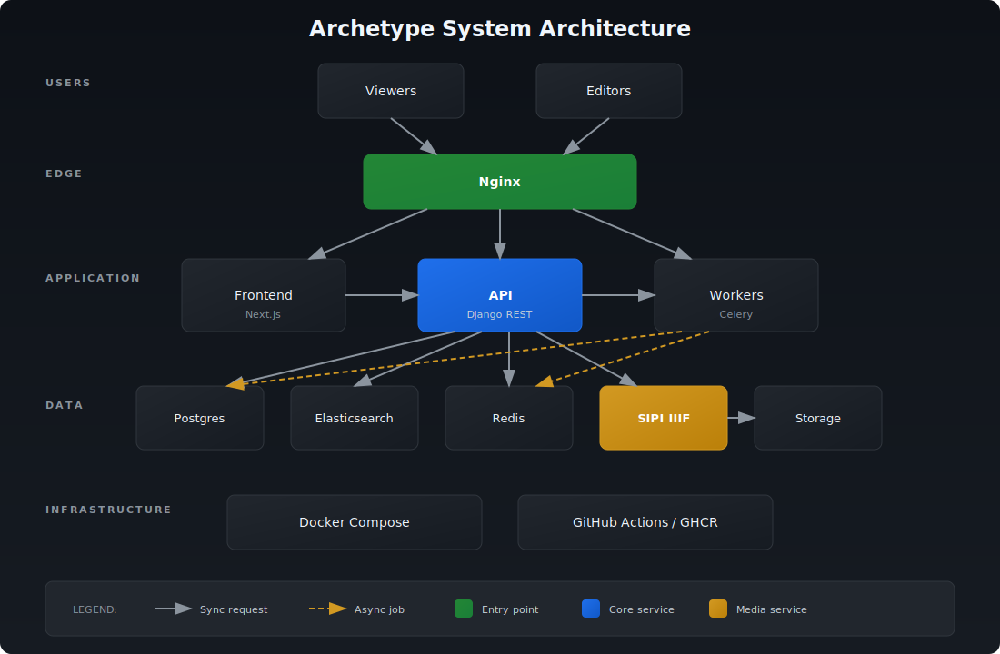

The reboot splits the platform into clear layers that can be deployed independently or as a full stack via Docker Compose.

## High-level view

| Layer | Responsibilities | Tech choices |
| --- | --- | --- |
| Backend APIs | Canonical data model, search endpoints, ingestion pipelines, authentication | Django + Django REST Framework, Poetry-managed dependencies, Celery-ready |
| Data services | Persistent storage, full-text search, media delivery | Postgres, Elasticsearch, Redis (optional), SIPI IIIF image server |
| Frontend | Scholar- and public-facing UI, IIIF viewers, editorial tooling | React + Next.js App Router, TypeScript, modern component libraries |
| Infrastructure | Local dev + prod orchestration, TLS termination, monitoring hooks | Docker Compose, Make targets, GitHub Packages for OCI images, Nginx, Certbot |
| Knowledge base | Docs, roadmap, marketing, release notes | Astro + Starlight (this repo), GitHub Pages deployment |

## Backend services

- **Framework:** The backend repo ships a modern Django/DRF application (Python 3, Poetry). API documentation lives at `/api/v1/docs`, so integrators can self-serve.
- **Datastores:** Postgres remains the source of truth for manuscripts, people, places, hands, annotations, and taxonomy metadata. Elasticsearch powers deep filtering and fuzzy matching. SIPI streams IIIF-compliant imagery so we can display tiles and annotations without custom servers.
- **Dev workflow:** `docker compose up` spins up the API plus supporting services. Make targets (`make up-bg`, `make migrate`) reduce the boilerplate for database migrations or hot reload.
- **Config:** Secrets live in `config/.env` files. A `config/test.env` is provided for quick setups.

## Frontend application

- **Next.js App Router:** We use Next.js to build a performant, React-based SPA with route-based code splitting and server actions when needed.
- **IIIF-aware UI:** Components talk directly to SIPI endpoints, unlocking deep zoom and annotation overlays.
- **Search-first UX:** API contracts are thin REST resources, so building elastic search experiences (autocomplete, result grouping, collections) stays simple.
- **Local dev:** `npm run dev` launches the frontend on `localhost:3000`, and `.env.local` values point at either local Compose services or staging APIs.

## Infrastructure and deployment

- **Docker everywhere:** Each service has an image published to the GitHub Packages registry. The infrastructure repo provides a Compose file plus Make targets (`make up-background`, `make migrate`, `make certbot`) for remote servers.
- **TLS + Nginx:** Production deployments follow the instructions in the `infrastructure` repo to request Let’s Encrypt certs and enable HTTPS via Nginx.
- **Observability hooks:** The Compose stack exposes logs through `docker compose logs -f`. Prometheus/Grafana integration is planned for a future milestone, but the structure leaves room for those sidecars.
- **GitHub Pages for docs:** This `site-gh` project builds with `npm run build` and deploys the `dist/` folder to the `gh-pages` branch, powering the public marketing/docs site.

## How services interact

1. Editors load the Next.js app, authenticate against the Django API, and fetch manuscript data via REST endpoints.
2. The frontend requests IIIF manifests and tiles from SIPI; annotations or highlights are handled via shared IDs stored in Postgres.
3. Search queries hit Elasticsearch through the API layer, which applies permissions and aggregates.
4. Docker Compose wires the services together locally; in production the same containers run under the infrastructure repo’s orchestration, complete with TLS and CDN-friendly headers.

Check the [Roadmap](/roadmap/) for milestone-specific upgrades (IIIF auth, background workers, monitoring) that will build on this foundation.

