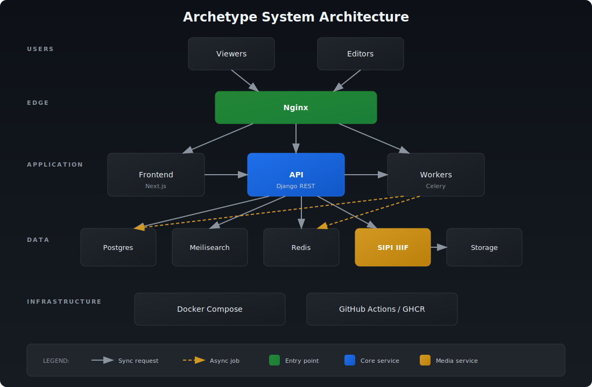

Archetype is built so that a manuscript corpus can be published, searched, viewed, and annotated as a coherent scholarly resource rather than a collection of static images. For a library or research project, the practical consequence is that the same platform serves the reading public, supports editorial work by a research team, and exposes standards-based interfaces that other tools can consume — without any of those roles interfering with the others. The system is deployment-agnostic: everything described here is a property of the open-source codebase and holds for any instance you stand up, whatever corpus it hosts.

The diagram above shows the moving parts. Below is what each layer does and how they cooperate.

## The layered services

An Archetype instance is a small set of cooperating services, each with one job:

- **API (Django + DRF)** — the authoritative application server. It owns the domain model, enforces permissions, and exposes a versioned REST API under `/api/v1/*`, with a machine-readable OpenAPI schema at `/api/v1/schema/` and interactive docs at `/api/v1/docs/`. It runs on Python 3.14, managed with `uv`, and is served as an ASGI application (uvicorn).
- **PostgreSQL** — the system of record. All curated data — manuscripts, hands and scribes, the graphical symbol taxonomy, annotations, and published pages — lives here.
- **Meilisearch** — the search index that powers fast, faceted discovery over the corpus. It is a derived store, rebuilt from PostgreSQL, never the source of truth.
- **Celery + Redis** — background task processing. When curators change data, re-indexing and other slow work run asynchronously through Celery workers, with Redis as the message broker, so the editing interface stays responsive.
- **SIPI** — the IIIF image server. It serves manuscript images from the filesystem over the [IIIF Image API](/platform/interoperability/), enabling deep zoom and region requests without shipping full-resolution files.
- **Frontend (Next.js + React)** — the web client (see [Search & Browse](/platform/search/)). It renders the public site and the backoffice, using server-side rendering for fast, indexable public pages.
- **nginx** — the reverse proxy and TLS terminator that presents the whole stack as one origin and keeps internal services off the public network.

### How a request flows

A visitor's request reaches nginx, which routes public page requests to the frontend and API calls to Django. The frontend reads through the public API for browse and search views; deep-zoom image tiles are requested directly against the IIIF endpoints served by SIPI. Search queries hit Meilisearch through the API rather than the database, which is what makes faceted filtering feel instantaneous even over a large corpus.

Writes follow a deliberately separated path. The backend keeps a clear internal division of responsibility: API views stay transport-only (validation, HTTP mapping, response shape); application services own orchestration and dispatch background work; and domain services own the actual mutation workflows. When a curator saves a record, PostgreSQL is updated first, then a Celery task propagates the change into Meilisearch so search results reflect it shortly afterwards. Search itself is registry-driven — a single registry declares the index types, so the set of searchable entities is explicit and extensible rather than hard-coded across the codebase.

## Domain organisation and standards

The backend is organised into feature apps that mirror the scholarly domain — manuscripts, scribes, a graphical symbols/structure taxonomy, annotations, worksets, publications, and users — described in full on the [Data model](/platform/data-model/) page. Two of these apps exist specifically to speak open standards: annotations are exposed in the [W3C Web Annotation](/platform/interoperability/) model, and manuscript images are published as [IIIF Presentation API](/platform/interoperability/) manifests with content search. This means the platform's core scholarly output — where a feature sits on a page, and what it means — is legible to any conformant viewer or aggregator, not locked inside one application.

## Build and deployment

The frontend uses **pnpm** (not npm) and the backend uses **uv** (not Poetry); both are pinned via lockfiles. Continuous integration runs on GitHub Actions, which lint, type-check, and test each repository, then build container images, scan them for vulnerabilities, and publish them to the GitHub Container Registry (GHCR) tagged by commit SHA. Deployment is a Docker Compose stack that pulls those immutable, digest-pinned images, so an operator can roll a deployment forward or back to an exact known build. The result is an architecture a small team can host reliably, with each layer independently observable, replaceable, and version-controlled.

> Every capability above is provided by the codebase itself. What differs between instances is the corpus, the branding, and operational configuration — not the architecture.
